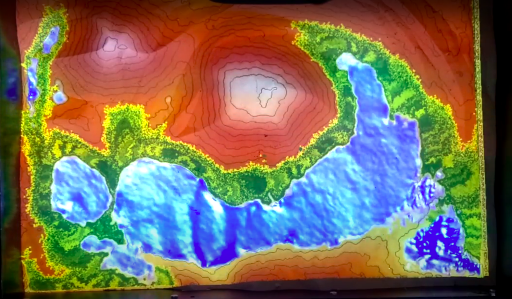

## INSTRUCTIONS
1) Download the updated SARndbox code from github: https://github.com/lmberg1/SARndbox
   and extract it to your ~/src/ directory. You can rename the directory to whatever
   you want, but make sure to update Config.h, SARndbox.cfg, and scripts/weather.sh 
   with the directory name that you choose (as well as your correct username 
   instead of /home/sandpit/)
2) Download the CImg Library from http://cimg.eu/download.shtml and extract it 
   to the directory of your choosing
3) Copy the CImg.h file from the extracted CImg directory into the new SARndbox 
   directory
3) Install the ImageMagick library (improves the functionality of the CImg library):
	sudo apt-get install imagemagick
4) Make the weather.sh script executable: chmod +x scripts/weather.sh
5) To use preset keyboard keys for the new tools, copy the new SARndbox.cfg file 
   into your .config directory:
   	cp etc/SARndbox-2.3/SARndbox.cfg ~/.config/Vrui-4.3/Applications/SARndbox.cfg
6) Make the SARndbox: make
7) Have fun with the new features!

## NEW FEATURES
1) Display an image on the sandbox with the 'Show Image' tool: 
   	Images can be any size, but should be 640x480 pixels to fit the sandbox.
      Currently, the image tool will accept .jpg, .png, and .tif file extensions. 
      You can update the supported image extensions by editing ImageTool.cpp and 
      adding more extensions in the "imageSelectionHelper" initializer near the 
      top of the page.
      
      If the image is not in the correct orientation when you load it into the
      sandbox, you can rotate and flip the image in the 'Show DEM Control' 
	section of the main menu.
      
      Some example images are in the locations/ directory. These should match the
      DEMs with the corresponding names, so you can recreate a DEM and then add
      the satellite image on top when you are finished. 
      
      
2) Set a base water level:
	Use the -bwl command line argument to set a base water level in the sandbox. 
	You can then use the 'Manage Water Level' tool to increase or decrease this 
	water level. You can set the amount by which the water level increases/decreases
	by editing the "waterLevelStep" value in the waterLevelTool section of the
	configuration file SARndbox.cfg. You can also change the base water level by 
	adjusting the slider in the 'Show Water Simulation Control' section of the 
	main menu while running the sandbox. 
3) Create earthquakes with the 'Create Earthquake' tool:
	This tool requires you to set three buttons. The first button will create
	a circular "tsunami" where the mouse is positioned (it must be positioned 
	over water). The second button helps collect two points that will be used
	to form a line from which a planar "tsunami" is generated. To collect the 
	points, position the mouse over each point and press the second button to 
	collect them. Once that step is completed, you can press the third button to 
	generate the planar tsunami from the line that you chose. You can re-choose
	the points as many times as you would like. You can also reverse the direction
	of propogation by reversing the order in which you choose the points. 
	
	The radius of the circular tsunami and the strength of the tsunami can be
	adjusted in the 'Show Earthquake Simulation Control' section  of the main
	menu while running the sandbox. 
4) Model simplistic vegetation growth with the 'Manage Vegetation' tool:
	The vegetation simulation will only work if a base water level is set, so 
	you must use the -bwl command line argument in conjuction with this tool. 
	
	This tool requires you to set two buttons. The first will try to grow a 
	patch of vegetation where the mouse is positioned. The vegetation will only
	grow if it's close enough to water, so if it doesn't grow when you press the
	button, try moving it closer to water. The second button will kill all the 
	vegetation that has grown. 
	
	The vegetation simulation is quite simplistic; vegetation will grow if it 
	is close enough to other vegetation and there is a high enough "hydration" 
	to pass a given value. The level of hydration is based on the height of a 
	point above the base water level. You can specify the hydration threshold 
	for vegetation to grow with the -vht command line argument. You can also 
	alter the rate of vegetation growth with the -vgr command line argument.  
	
	
5) Show a slope map with the 'Show Slope' tool:
	This tool toggles a view of slope color mapping, meaning that the sand colors
	will be based on the slope of the sand instead of the height. The mapping
	isn't perfect, but works particularly well for very steep areas.
	
	The slope color mapping will automatically be set from the slope map file 
	specified in Config.h. You can change which color map is loaded by using 
	the -usm command line argument. 
	
	
6) Easier DEM matching:
	After loading a .grid file into the sandbox, open the 'Show DEM Control' 
	section of the main menu and change the values of the sliders to help adjust
	the vertical scale and vertical shift of the DEM. Once you are satisfied, 
	you can save an input graph, which will save the values that you chose to 
	best match the DEM into the sandbox. If you find a vertical shift that works
	well for your sandbox setup, you can set it as the default vertical shift
	with the -dvs command line argument. 
	
	It is possible that the slider limits are too small/large to fit your DEM. 
	If this is the case, you can still set a smaller/larger vertical scale or 
	shift in the SARndbox.cfg file. You can also edit the limits themselves in 
	the "Sandbox::createDemControlDialog" function of the Sandbox.cpp code. 
7) Shift the height color mapping up and down:
	This tool has two buttons. The first will shift the color map 'up,' meaning
	that there will be less blue sand. The second will do the opposite. You can
	use this to simulate changing the sea level without adding actual water into 
	the sandbox such as with the -bwl command. 

## SCRIPTS
weather.sh: 
	Choose the weather values which should be cycled through by modifying the 
	weather array.
	Make the file executable: chmod +x weather.sh

downloadDem.py:
	This program downloads a DEM file in 640x480 resolution using python elevation api.
	To use it, you must have python2.7 and pip installed:
		sudo apt-get install python2.7
		sudo apt-get install python-pip
	You must then install the python elevation package. 
		sudo pip2 install elevation
